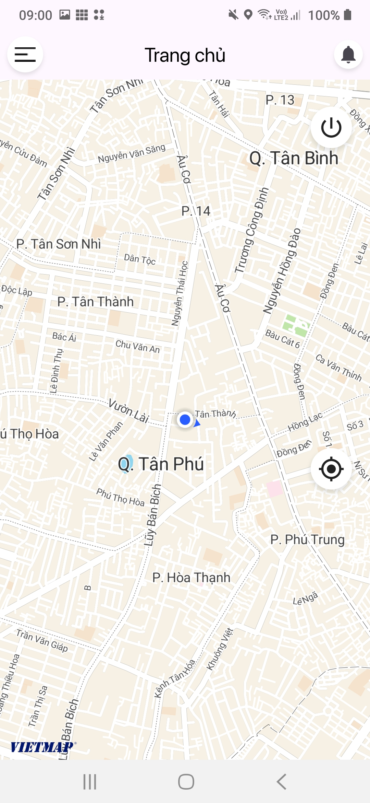
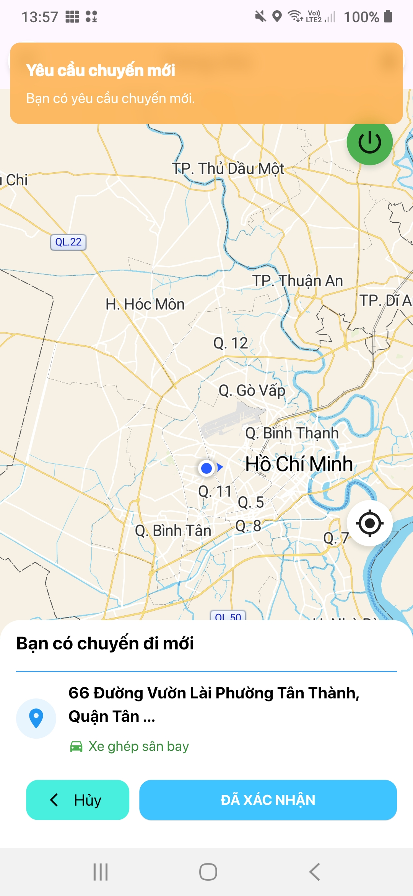
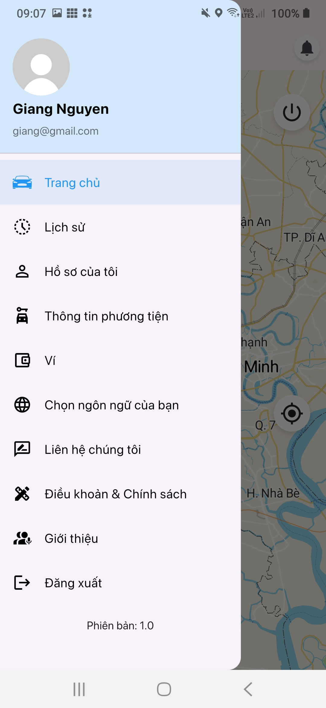
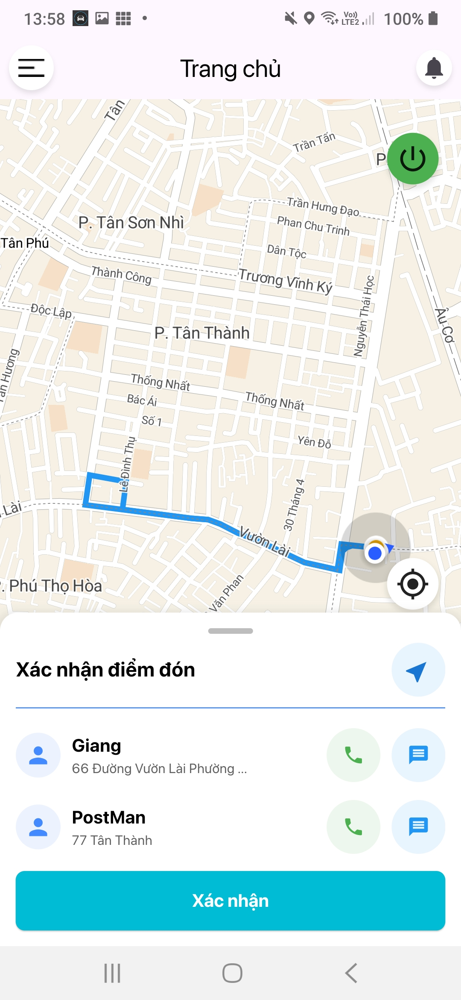

# Airport Booking Car App - Driver Side

A mobile application developed with Flutter, designed for drivers to manage airport ride bookings effectively.

## Introduction

This Flutter app is built for drivers to handle ride requests, navigate routes, and manage trips in real-time.

## Technologies Used

- **Flutter**: Main framework for cross-platform UI.
- **GetX**: Manages state, navigation, and dependencies.
- **Firebase**: Supports real-time push notifications for new bookings and trip updates.
- **Back-end**: [Airport-Booking-Car-Backend](https://github.com/ndgiang02/Airport-Booking-Car-Backend)

## Key Features

- **Manage Ride Requests**: View and accept or reject new ride requests.
- **Navigation**: Integrated route guidance for efficient trip management.
- **Push Notifications**: Receive instant alerts for new bookings and trip status.

## Screenshots

  
  
  
  

